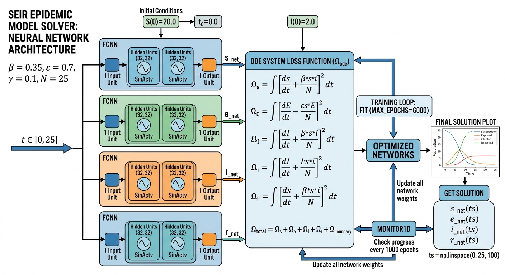

# Implementation of Oscillatory Neural Networks for the Simulation of Nonlinear Dynamical Systems

<p align="center">
<b>A deep learning framework based on Oscillatory Neural Networks (ONNs) for solving nonlinear dynamical systems with an application to the COVID-19 SEIR epidemic model.</b>
</p>

---

# 📖 Overview

This repository presents an implementation of **Oscillatory Neural Networks (ONNs)** for the numerical simulation of nonlinear dynamical systems governed by ordinary differential equations (ODEs).

As a case study, the framework is applied to the classical **SEIR (Susceptible–Exposed–Infected–Recovered)** epidemic model describing the transmission dynamics of COVID-19.

Traditional numerical solvers such as Runge–Kutta methods require iterative computations and may become computationally demanding for complex nonlinear systems. In contrast, the proposed approach employs **Oscillatory Neural Networks (ONNs)** trained using **Stochastic Gradient Descent (SGD)** to directly approximate the solution of the governing differential equations while satisfying the prescribed initial conditions.

The implementation is built using the **NeuroDiffEq** library, which enables neural networks to solve differential equations through automatic differentiation.

---

# ✨ Key Features

- Deep learning solver for nonlinear ordinary differential equations
- Oscillatory Neural Networks (ONNs)
- Stochastic Gradient Descent (SGD) optimization
- Automatic differentiation using NeuroDiffEq
- Physics-based solution of SEIR epidemic model
- Simultaneous prediction of all SEIR compartments
- No finite difference discretization required
- Visualization of epidemic dynamics
- Easy-to-modify neural network architecture
- Fully reproducible implementation

---

# 🔬 Methodology

The proposed framework consists of the following stages:

1. Define the nonlinear SEIR differential equations
2. Specify initial conditions
3. Construct Oscillatory Neural Networks
4. Train the networks using Stochastic Gradient Descent
5. Obtain continuous neural-network solutions
6. Visualize epidemic dynamics
7. Compare with numerical reference solutions

---

# 🦠 SEIR Epidemic Model

The implemented epidemiological model consists of four compartments:

| Variable | Description |
|-----------|-------------|
| **S** | Susceptible population |
| **E** | Exposed population |
| **I** | Infected population |
| **R** | Recovered (Removed) population |

The governing equations are

\[
\frac{dS}{dt}=-\frac{\beta SI}{N}
\]

\[
\frac{dE}{dt}=\frac{\beta SI}{N}-\epsilon E
\]

\[
\frac{dI}{dt}=\epsilon E-\gamma I
\]

\[
\frac{dR}{dt}=\gamma I
\]

where

- **β** = Transmission rate
- **ε** = Incubation rate
- **γ** = Recovery rate
- **N** = Total population

---

# 🧠 Oscillatory Neural Network Architecture

<p align="center">

</p>

Each SEIR compartment is approximated using an independent fully connected Oscillatory Neural Network.

The architecture consists of:

- Input layer (time)
- Two hidden layers (32 neurons each)
- Sinusoidal activation function (SinActv)
- Output layer representing one state variable

A separate neural network is trained for each compartment:

- Susceptible
- Exposed
- Infected
- Recovered

Automatic differentiation computes derivatives required by the differential equations during optimization.

---

# 📊 Workflow


The complete workflow consists of

- Define SEIR equations
- Initialize epidemic parameters
- Specify initial conditions
- Build Oscillatory Neural Networks
- Train using SGD optimization
- Solve differential equations
- Predict epidemic trajectories
- Visualize results

---

# ⚙️ Model Parameters

The implementation uses the following parameters:

| Parameter | Value |
|-----------|-------|
| Transmission Rate (β) | 0.35 |
| Incubation Rate (ε) | 0.70 |
| Recovery Rate (γ) | 0.10 |
| Population (N) | 25 |
| Epochs | 6000 |
| Hidden Layers | 2 |
| Hidden Units | 32 |
| Activation Function | SinActv |

---

# 💻 Software and Libraries

The project is implemented using

- Python
- PyTorch
- NeuroDiffEq
- NumPy
- SciPy
- Matplotlib

---

# ⚙️ Requirements

Install the required packages

```bash
pip install torch
pip install neurodiffeq
pip install matplotlib
pip install scipy
pip install numpy
```

or

```bash
pip install -r requirements.txt
```

---

# 📁 Repository Structure

```
ONNs-SEIR/
│
├── data/
│
├── figures/
│   ├── Workflow.png
│   ├── Architecture.png
│   ├── SEIR_Curves.png
│   └── Loss.png
│
├── notebooks/
│   └── ONNs_SEIR.ipynb
│
├── src/
│   ├── model.py
│   ├── train.py
│   ├── solver.py
│   ├── utils.py
│   └── visualize.py
│
├── results/
│
├── requirements.txt
├── README.md
└── LICENSE
```

---

# 🚀 Installation

Clone this repository

```bash
git clone https://github.com/YourUsername/ONNs-SEIR.git
```

Move into the project directory

```bash
cd RK4_SEIR.ipynb
```

Install dependencies

```bash
pip install -r requirements.txt
```

---

# ▶️ Usage

Run the complete implementation

```bash
python train.py
```

or execute the Jupyter Notebook

```bash
ONNs_SEIR.ipynb
```

The program automatically

- Defines the SEIR model
- Builds Oscillatory Neural Networks
- Trains the model
- Solves the nonlinear system
- Produces epidemic curves

---

# 📈 Results

The trained Oscillatory Neural Networks successfully learn the nonlinear behavior of the SEIR epidemic model.

Generated outputs include

- Susceptible curve
- Exposed curve
- Infected curve
- Recovered curve
- Neural network approximation
- Training loss
- Solution comparison

The proposed ONNs-SGD framework demonstrates high numerical accuracy while avoiding explicit numerical discretization of the governing differential equations.

---


# 🔍 Applications

This framework can be applied to

- COVID-19 epidemic modeling
- Infectious disease forecasting
- Ordinary differential equations
- Scientific Machine Learning
- Physics-Informed Neural Networks
- Computational Epidemiology
- Mathematical Biology
- Dynamical System Simulation

---

# 📚 Citation

If you use this repository in your research, please cite

```text
Mirza Mudassar Hussain et al.

Implementation of Oscillatory Neural Networks for the Simulation of Nonlinear Dynamical Systems.
```

---

# 🤝 Contributing

Contributions are welcome.

Please open an issue or submit a pull request for bug fixes, feature requests, or improvements.

---

# 📧 Contact

**Mirza Mudassar Hussain**

PhD Scholar

Institute of Mathematics

University of the Punjab

Lahore, Pakistan

📧 Email: mudasser.mh@gmail.com

🌐 GitHub: https://github.com/Mirza-PU

---

# 📄 License

This project is released under the **MIT License**.

---

# 🙏 Acknowledgements

The authors gratefully acknowledge

- NeuroDiffEq
- PyTorch
- NumPy
- SciPy
- Matplotlib
- Open-source Scientific Machine Learning Community

---

<p align="center">

## ⭐ If you find this repository useful, please consider giving it a Star!

</p>
